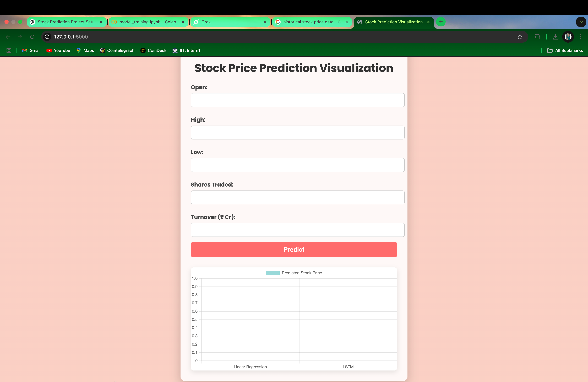
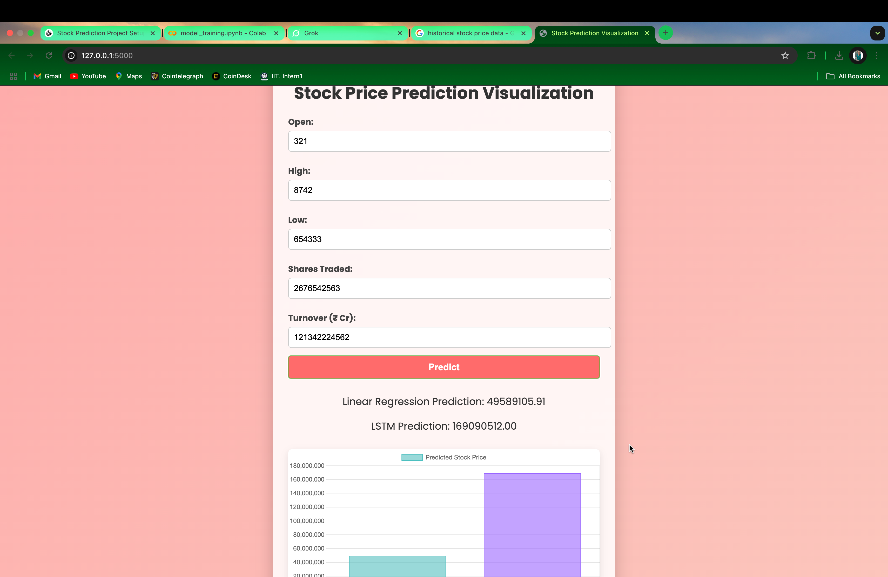
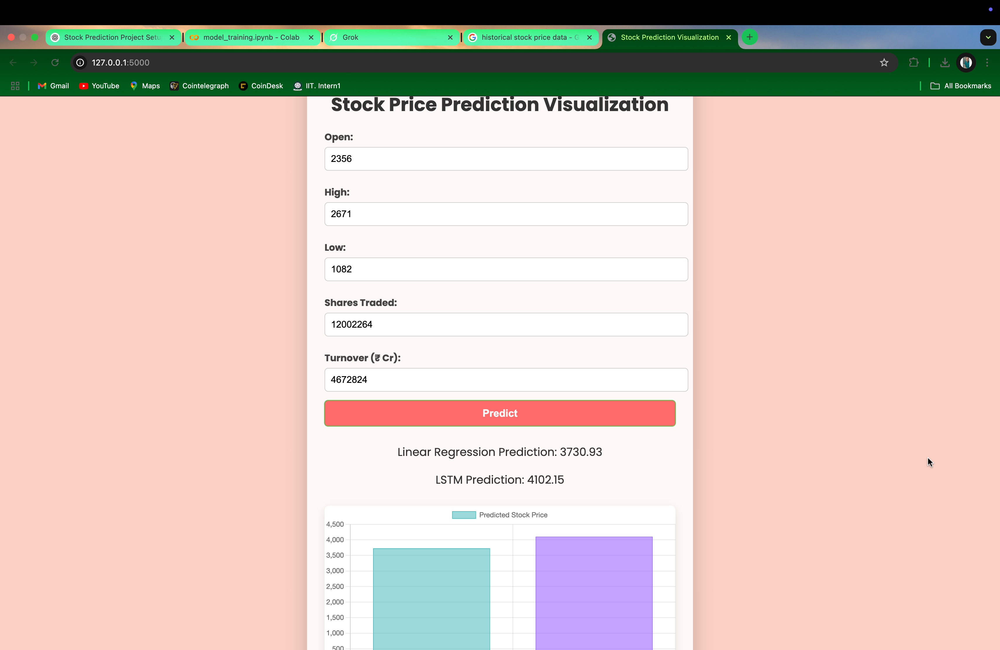

<h1 style="color: #2F4F4F; text-align:center;">
  <b>Stock Price Prediction using Machine Learning</b>
</h1>

  <em>Predict stock prices using ML models like LSTM and Linear Regression</em>

<h2 style="color:#4169E1;">1. Overview</h2>

  This project aims to predict stock prices using Machine Learning techniques. It leverages historical market data and applies models such as 
  <strong>Long Short-Term Memory (LSTM)</strong> and <strong>Linear Regression</strong> for forecasting stock prices. Key features include:

<ul>
  <li><strong>Data Processing:</strong> Reads stock market data and applies preprocessing techniques.</li>
  <li><strong>Feature Scaling:</strong> Uses MinMaxScaler for better model performance.</li>
  <li><strong>Model Training:</strong> Implements LSTM for time-series forecasting and Linear Regression for trend prediction.</li>
  <li><strong>Web Interface:</strong> A frontend to visualize predictions using HTML, CSS, and JavaScript.</li>
</ul>

<h2 style="color:#4169E1;">2. Project Structure</h2>

<pre>
Stock-Price-Prediction/
├── backend/
│   ├── app.py                # Flask backend for model inference
│   ├── requirements.txt      # Python dependencies
│
├── data/
│   ├── NIFTY 500-02-01-2024-to-02-01-2025.csv  # Stock market dataset
│
├── frontend/
│   ├── static/
│   │   ├── css/
│   │   │   ├── style.css      # Frontend styling
│   │   ├── js/
│   │   │   ├── main.js        # JavaScript for interactivity
│   ├── templates/
│   │   ├── index.html         # Main webpage template
│
├── models/
│   ├── linear_regression_model.pkl  # Trained Linear Regression model
│   ├── lstm_model.h5                # Trained LSTM model
│   ├── scaler.pkl                    # Scaler used for data normalization
│
├── notebooks/                         # Jupyter Notebooks (if any)
│
├── screenshots/
│   ├── homepage.png
│   ├── results1.png
│   ├── results2.png
│
├── venv1/                             # Virtual environment (optional)
├── README.md                          # Project documentation
└── .gitignore                         # Git ignore rules
</pre>

<h2 style="color:#4169E1;">3. Installation</h2>

<ol>
  <li>
    <strong>Clone this repository:</strong>
    <pre><code>git clone https://github.com/deephabiswashi/Stock-Predictor.git</code></pre>
  </li>
  <li>
    <strong>Create and activate a virtual environment (optional):</strong>
    <pre><code>python -m venv venv
source venv/bin/activate    # On Windows: venv\Scripts\activate
</code></pre>
  </li>
  <li>
    <strong>Install dependencies:</strong>
    <pre><code>pip install -r requirements.txt
</code></pre>
  </li>
</ol>

<h2 style="color:#4169E1;">4. Usage</h2>

<ol>
  <li><strong>Run the Flask backend:</strong>
    <pre><code>python backend/app.py</code></pre>
  </li>
  <li><strong>Access the web interface:</strong>
    <pre><code>Open http://127.0.0.1:5000 in your browser</code></pre>
  </li>
  <li><strong>View predictions:</strong> Upload stock data and see LSTM & Linear Regression predictions.</li>
</ol>

## 🔹 Demo Video

🔗 Click the image above to watch the demo on YouTube.

## 🔹 Screenshots

### 🏠 Homepage

### 📈 Prediction Results 1

### 📊 Prediction Results 2

## 🔹 Dataset Source

This project uses historical stock price data from **[NSE (National Stock Exchange of India)](https://www.nseindia.com/reports-indices-historical-index-data)**.

📌 **Credit:** All rights to the dataset belong to NSE India. The dataset was sourced from their official **historical index data** section.

<h2 style="color:#4169E1;">5. Contributing</h2>

  Contributions are welcome! Feel free to open issues or submit pull requests.

<h2 style="color:#4169E1;">6. License</h2>

  This project is licensed under the <strong>MIT License</strong>.

  <em>Made with ❤️ by Deep</em>

